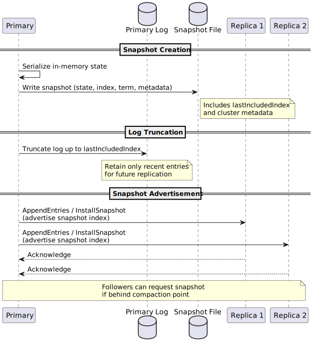
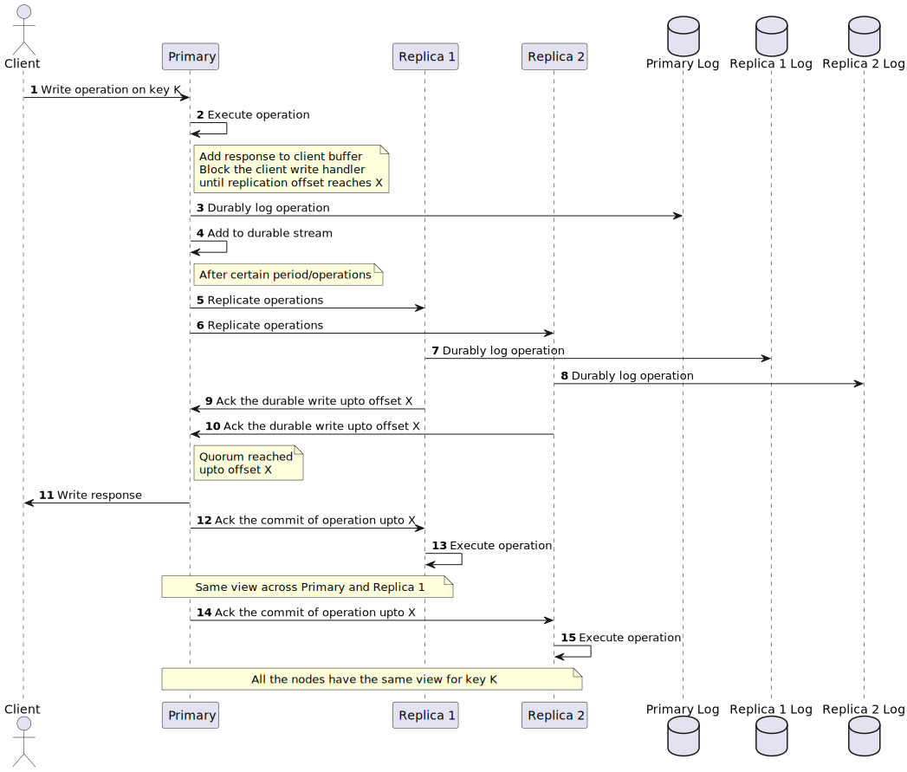
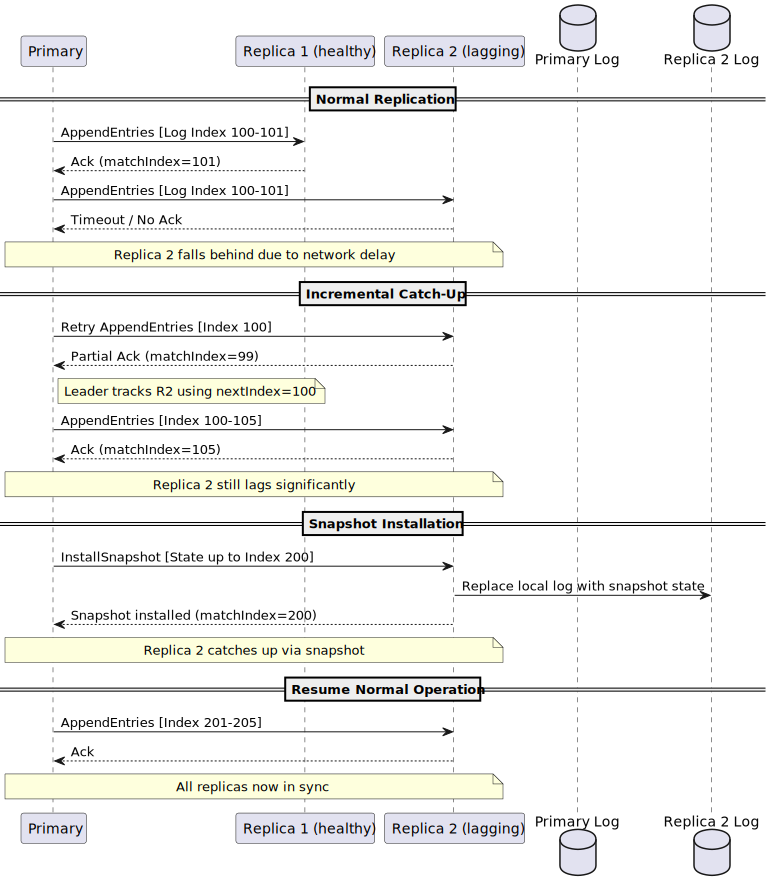

# Durability High Level Design Document

## Problem Statement

Valkey is an in-memory data store designed for high performance. Valkey currently uses an asynchronous replication model for high throughput and low latency, which means writes acknowledged to clients may be lost if replicas lag, crash, or are promoted while out-of-sync. Because all data resides in memory by default, process restarts or crashes risk losing recent writes. Although periodic snapshots (RDB) and append-only logs (AOF) provide persistence, they entail trade-offs: snapshots may omit recent writes and AOF only supports single-node durability. In cluster mode, data loss remains possible when a replica is promoted prematurely. Shifting durability responsibility to clients (via WAIT) is not intuitive and places burden on the application layer.

## Motivation

While Valkey’s asynchronous model prioritizes performance, many production workloads demand stronger guarantees where acknowledged writes will never be lost, even under failures. This specification introduces a unified durability layer that defines when a write is truly “safe” ensures deterministic behavior during failover, and simplifies client integration by removing the need for ad-hoc mechanisms like `WAIT`.

To achieve this, the specification adopts a formally defined state machine replication model, namely [RAFT](https://en.wikipedia.org/wiki/Raft_(algorithm)), making the guarantees explicit and verifiable acting as a precise contract between the system and its users.

## Requirements

Please refer [https://github.com/valkey-io/valkey-rfc/pull/29/](https://github.com/valkey-io/valkey-rfc/pull/29/files) for detailed requirements

* Server level durability configuration - Valkey must allow enabling/disabling durability mode at startup.
* Read Committed isolation level - Every write operation is serialized on primary and client won't see a volatile key.
* Maintain current deployment architecture - No additional dependencies.
* Support standalone/cluster(single shard) modes.  
* Support a minimum 3 node configuration - one primary and two (or more) replicas.

Planned for future:

* Dirty reads and configurable isolation level
* Multi shard durability - Allow scaling of writes.
* Two node durability configuration (one primary and one replica)

## Design Overview

The durability specification introduces a **RAFT-based state machine replication** model at the shard level, ensuring deterministic leadership, consistent log replication, and predictable recovery across Valkey cluster. Each shard operates as an independent group consisting of one leader (primary) and multiple followers (replicas).
All write operations flow through the primary and are durably replicated before being acknowledged.
Replication and election are handled at shard granularity, ensuring fault isolation and predictable recovery. A write is considered durable once it has been replicated to a quorum of nodes and safely committed in the leader’s log. Acknowledged writes are guaranteed to survive any single-node or minority failure.

Elections are managed using RAFT’s randomized timeout and term-based voting mechanism, ensuring that at any point, only one valid leader can exist per shard. Followers that fall behind automatically catch up through incremental log replication. 

### Key Components

There are a few major parts to Valkey to be modified to add durability support.

1. Command execution (in-memory view)
2. Blocking
3. Logging
4. Topology

### Command Execution

All write commands are routed to the shard leader (primary), which serves as the serialization point for that shard.
 The leader ensures serializable execution by processing commands in the exact order they are received, establishing a single total sequence for all writes.

Upon receiving a write:

1. The leader applies the command to its local in-memory state immediately, ensuring fast execution.
2. The corresponding log entry is appended to the RAFT log and replicated asynchronously to follower nodes.
3. The client response is blocked until quorum acknowledgment confirms that the entry is durably replicated and committed.

This design allows the system to continue command execution and replication in parallel, while ensuring that clients only receive success once durability is guaranteed.
If the leader fails before quorum commit, uncommitted entries are rolled back or overwritten during recovery.
Followers apply committed entries strictly in log index order, ensuring deterministic state across replicas.

### Blocking

Blocking determines when a client receives acknowledgment for an operation relative to its durability state.
While the leader applies a command immediately to its in-memory state, the client response is held until the entry is confirmed by the configured durability mode. This ensures that acknowledgment semantics always reflect the intended durability guarantees. The client remains blocked until a quorum of replicas (**synchronous mode**) acknowledges the log entry, guaranteeing durability against minority or single-node failures.

Blocking occurs only at the primary. Replica nodes apply entries passively as they are received and do not block client operations directly.
Read operations and other non-durable commands are not affected by blocking behavior.

> Note:
>
> We could make the blocking mode configurable in the future and introduce two additional modes:
>
> * **Asynchronous mode:** The client receives acknowledgment immediately after the leader applies the command locally. This mode prioritizes latency over durability.
> * **Semi-synchronous mode:** The client is unblocked once at least one replica acknowledges the log entry, providing a balance between durability and performance.

#### Memory Pressure from client output buffers

Under high pressure of write load or when replicas fall behind, the number of blocked clients can grow significantly, leading to increased memory pressure on the primary. Each blocked client consumes memory for pending responses on the output buffers. This will capped by the existing configuration of client-output-buffer-limit for replica (replication buffer limit). 

Open Questions:

* Should a mechanism be introduced to temporarily block all new write traffic once the replication buffer limit is reached, effectively stalling writes until the backlog is cleared? This could prevent unbounded memory growth and avoid triggering failover operations caused by memory exhaustion. 
* Should we perform a side channel heartbeat (AppendEntries with no content) to keep the primary healthy?

### Logging

The logging subsystem forms the backbone of durability in this specification. Every write operation is recorded in a replicated, append-only log that defines a total, ordered sequence of commands within each shard. This log is responsible for guaranteeing that once an entry is committed, it can be recovered, replayed, and applied consistently across all replicas. It also serves as the basis for replication (through RAFT’s AppendEntries), leader election safety, and fault recovery.

The integration between the log and Valkey’s in-memory execution model can follow two distinct approaches

#### Write-Ahead Logging

In the write-ahead logging approach, every command is first recorded in the replicated RAFT log before any modification is made to the in-memory state. This ensures that the log always represents the authoritative record of intended changes, allowing recovery to replay committed entries deterministically after failure.

#### Pro(s)

1. Opt to blocking of read operation on modified key(s).
2. If the durable operation fails, there is no dirty data to cleanup on the primary and the operation can be retried.

#### Con(s)

1. Commands with random operation like `SPOP` needs to be made deterministic across all the nodes in a shard.
2. Lua scripts cannot be safely supported under write-ahead logging because their read and write sets are only known during execution. Since WAL requires the command to be logged before execution, it cannot capture the dynamic side effects or conditional logic inside a script.
3. Commands with blocking operation needs special handling 

#### Write-Behind logging (Recommended)

In the write-behind logging approach, a command is first applied to the primary’s in-memory state before being appended to the replicated RAFT log. This is inline with the current asynchronous replication model. This allows command execution and replication to proceed in parallel, maintaining Valkey’s low-latency characteristics while still ensuring durability through delayed acknowledgment.

#### Pro(s)

1. Handles all operation (regular commands, random commands, blocking commands) in straight forward approach. `SPOP` gets translated to `SREM` making it a deterministic command.
2. Lua scripts fit well with Write-behind logging since the script executes atomically on the primary before replication.
   The primary runs the entire script, producing a deterministic sequence of writes that can then be logged and replicated to followers.

#### Con(s)

1. Blocks the key for both read/write operation until the operation has been durably stored across the shard.
2. Introduces challenges to handle uncommitted entries due to node failures leading to potential failover operation and replaying the data to sync.

##### Side-by-Side Comparison 

| Stage                | Write-Ahead Logging      | Write-Behind Logging       |
| -------------------- | ------------------------ | -------------------------- |
| 1. Receive command   | Append to log, replicate | Apply to memory, replicate |
| 2. Wait for quorum   | Before execution         | Before acknowledgment      |
| 3. Apply to memory   | After quorum             | Already done               |
| 4. Respond to client | After apply              | After quorum               |

| Aspect                                                       | Write-Ahead Logging (WAL)                                    | Write-Behind Logging (WBL)                                   |
| ------------------------------------------------------------ | ------------------------------------------------------------ | ------------------------------------------------------------ |
| Latency                                                      | Similar client-visible latency                               | Similar client-visible latency                               |
| Lua Scripts                                                  | Not supported. The write set is unknown before execution, making it impossible to log deterministically in advance. | Fully supported. Scripts execute atomically on the leader, and resulting writes are logged and replicated deterministically. |
| Random / Non-Deterministic Commands (e.g., `SPOP`, time-dependent logic) | Difficult to reproduce deterministically across replicas; unsafe under WAL. | Safe, since the command executes once on the leader and replicas only replay the deterministic result. |
| Expiration / TTL Handling                                    | Must log expiration events before applying them; can cause drift if clocks differ. | Similar to current Valkey behavior. Expirations are handled locally after commit and replicated as deterministic deletion. |
| Eviction (LRU/LFU)                                           | Harder to synchronize across replicas since memory changes occur only post-commit, eviction triggers may diverge. | Similar to current Valkey behavior. replicas eventually converge through state updates from primary. |
| Memory Pressure                                              | Lower runtime memory pressure because commands are not applied until committed; smaller transient state. | Higher memory pressure under replication lag, as unacknowledged writes and blocked client buffers accumulate. |

#### Log Compaction ([UML Code](./assets/UML.md#uml-code-for-log-compaction))

Log compaction is the process of truncating old, committed log entries that are no longer required for recovery, replacing them with a compact snapshot of the current state. This ensures that the replicated log remains bounded in size, preventing unbounded memory growth and reducing catch-up time for lagging replicas.

### Logging embedded within Valkey

#### Pro(s):

1. Repurpose existing pieces for snapshotting, durable log (AOF)
2. Single unified deployment 

#### Cons(s):

1. Requires building synchronous replication or quorum based replication system.
2. More overlap of asynchronous replication and synchronous replication system.

#### Main thread vs Background thread

### Main Thread

- Logging and replication are handled directly within Valkey’s primary event loop.
- Commands, log appends, and replication I/O share the same execution path and scheduling.
- Log ordering is inherently aligned with command execution order.
- Simplifies correctness and state management since all actions occur on a single thread.
- Replication acknowledgment and client blocking are managed within the same loop cycle.
- Suitable for environments where predictability and deterministic command sequencing are more important than full CPU utilization.

### Dedicated Logging Thread

- The main thread executes commands and enqueues log entries for a background replication/logging thread.
- The logging thread manages replication, quorum acknowledgment, and commit advancement asynchronously.
- Communication between the main thread and logging thread occurs via a bounded, ordered queue.
- Avoids stalling issues with long running command execution/LUA script execution 
- Requires coordination between main thread and logging thread about offset progress.
- Could extend the io threads framework used primarily for networking.

>  Note:
>
> * We should start with same thread for end-to-end operation for P0 and then move to further improvements.
> * Should we consider an approach for initial release to allow the logging component to be available as in-memory instead of fsync it on disk? This mechanism would allow higher throughput and lower latency. Need to assess the risks/recovery time on node failure to perform a full synchronization from the primary and it's affect on failure to reach quorum.

## Topology

Topology management within the durability specification is governed by the RAFT consensus model. Each shard operates as an independent RAFT group, and all membership change such as adding or removing replicas are handled as configuration change entries in the RAFT log. This ensures that updates to the shard topology are serialized, replicated, and committed like any other operation, maintaining a consistent and deterministic view of membership across all nodes.

When a new node joins, the leader initiates a configuration change proposal, replicates it to the quorum, and applies it once committed. Removal follows the same mechanism, guaranteeing that no two conflicting configurations exist concurrently. RAFT’s consensus approach is used during reconfiguration to safely transition between old and new membership sets, avoiding split-brain conditions.These configuration entries are replicated through the same log pipeline as normal commands, ensuring that both data and topology are part of the same durable mechanism.

Here we cover various operation via sequence diagram within a shard.

1. Bootstrap
2. Node addition
3. Primary removal
4. Replica removal

### Bootstrap ([UML code](./assets/UML.md#uml-code-for-bootstrap))

> Note:
>
> * How to discover peer nodes? 
>   * We can't reuse the `REPLICAOF` mechanism as we intend to piggyback on RAFT's consensus model for leader election.
>   * Hence, new nodes can discover peers via the `shard-nodes` config which is a list of ip:port address.
> * When to start the initialization phase? - To be added

### Node addition([UML Code](./assets/UML.md#uml-code-for-node-addition))

### Primary removal ([UML Code](./assets/UML.md#uml-code-for-primary-removal))

### Replica removal ([UML Code](./assets/UML.md#uml-code-for-replica-removal))

### Lifecycle of a write command ([UML Code](./assets/UML.md#uml-code-for-lifecycle-of-a-write-command))

### Lifecycle of a read command ([UML Code](./assets/UML.md#uml-code-for-lifecycle-of-a-read-command))

## Failure Handling

### Primary liveness ([UML Code](./assets/UML.md#uml-code-for-leader-liveness))

The primary maintains liveness through periodic heartbeat messages sent to all replicas within the shard.
These heartbeats are implemented as empty `AppendEntries` RPCs and serve to assert the leader’s authority, prevent election timeouts on followers, and detect connectivity issues early.

### Primary Failure (Automatic Failover) ([UML Code](./assets/UML.md#uml-code-for-primary-failure))

If a replica fails to receive heartbeats within its election timeout window, it transitions to a candidate state and initiates a new term election. This mechanism ensures continuous availability and timely leader re-election in the presence of network delays or partial failures, without requiring an administrator/operator involvement.

Election timeouts for followers are randomized within a bounded range to prevent multiple replicas from starting elections simultaneously (similar to Valkey decentralized cluster election mechanism). This randomness reduces the likelihood of split votes and ensures that one candidate reaches the quorum and leadership is restored, enabling writes to resume. During an election, replicas grant their vote only to candidates whose logs are at least as up-to-date as their own, guaranteeing that any newly elected leader always possesses the most complete log.

### Replica Failure

Has the same behavior as replica removal outlined earlier in the topology change section.

### Slow or Lagging Replica

When a replica falls behind the primary due to network delays or busy engine, the leader continues to serve write traffic as long as quorum of replicas are responsive.
The leader tracks replication progress per follower using `nextIndex` and `matchIndex` values, retrying missing `AppendEntries` messages to help the slow replica catch up incrementally.
If the lag grows beyond the range of the leader’s active log (for example, after compaction), the leader installs a state snapshot to synchronize the follower with the latest committed state.
Throughout this process, slow replicas are excluded from quorum calculations, ensuring that cluster availability is not affected. Once synchronization completes, the replica resumes normal replication and re-enters the commit path without requiring manual intervention.

### Complete Write Outage ([UML Code](./assets/UML.md#uml-code-for-write-outage))

Complete write outage in a shard can be observed when quorum isn’t possible to reach for a write operation. This could be due to network partition for a period exceeding the timeout period of a client and the operation result couldn't be acknowledged back to the client. This would leave the primary dirty and in an inconsistent state. Hence, it's required to perform a failover and replay the local log upto the committed entries on the new primary to stabilize the node.

## Impact on sub components

### ACL

No impact on ACL

### AOF

Append Only File (AOF) logs every write operation received by the server. This will co-exist for single node durability system and to be backward compatible reasons for Valkey users. As part of the low level design we will plan to reuse or refactor components for the durable log system.

### Asychronous Replication

Asynchronous replication system will co-exist with the synchronous replication system to allow users to use Valkey with high availability but not high durable system i.e. backward compatible in terms of performance/behavior. As part of the low level design we will plan to reuse or refactor components for the synchronous replication system.

### Atomic Slot Migration

This should mostly remain the same however the two phase commit and change in topology needs to be added as metdata to the RAFT log.

> Note: Multi shard cluster is not part of P0.

### Cluster

Clustering is composed of three intertwined mechanisms:

1. **Topology Gossip**
2. **Health/Failure Detection**
3. **Failover Operation**

With RAFT introduced at the shard level, consensus is built in for durable data transfer within each shard. RAFT also manages leader election through regular heartbeats: when a leader fails, a new candidate from within the shard is promoted. This RAFT-based leader failure detection overlaps heavily with the existing clusterbus health detection and best-effort failover systems. To avoid duplication, both of those must be disabled.
The cluster bus can still be repurposed for topology gossip across shards. This introduces only minimal overhead and does not affect shard ownership. It remains useful for client redirection of datapath commands (read/write operations).

> Note: If we decide to not support cluster-enabled mode in P0 we could punt the work of modularization of health detection/failover for later period.

### Keyspace notifications

Keyspace notification also needs to be buffered on the client output buffer subscribed via pub/sub channels and the client is blocked until quorum is reached for a given key modification based on the offset. The notification will be sent out once the key has been committed on the primary. Keyspace notifications aren't generated on replicas.

> Note: Based on the speculative execution of the command on the primary, it's possible to send out notification (pre commit and post commit) which might be handy for modules to also perform speculative operation like search module can trigger index update operation in parallel with the data getting durably logged across the quourum of nodes.

### Pub/Sub

Pub/Sub in standalone setup uses replication link to transfer the data to replicas and in cluster-enabled setup uses the cluster-bus link to transfer data within shard as well as across shard. There shouldn't be any change in mechanism around Pub/Sub.

### Snapshots

RDB persistence performs point-in-time snapshots of your dataset at specified intervals. This mechanism will exists for backups. This will have the same format which exists.

## Contributors

This document is a collaborative effort across multiple individuals and companies. The individuals (lexicographic ordering by first name) named below helped with active discussions and brainstorming.

1. Jules Lasarte (AWS)
2. Kevin Mcgehee (AWS)
3. Madelyn Olson (AWS)
4. Ping Xie (Google)
5. Ricardo Dias (Percona)
6. Viktor Soderqvist (Ericsson)

Pardon me if I accidentally missed out people's name (send me a DM, I will get it updated)

## Appendix

### Alternative design with decoupled log storage

This approach is different from the recommendation above with decoupling the durable storage component from the Valkey in-memory store engine. The key benefit with this proposal is that the shard can have 1 primary and 1 replica setup and don't need RAFT consensus model at shard level. It allows the primary to maintain lease with (distributed) durable log engine and failover if the lease expires. 

The key challenge with the proposal is it leads to a different deployment architecture and will make it complex for users to maintain two separate components.

### UML Code

All the UML code can be found under [./assets/UML.md](./assets/UML.md)