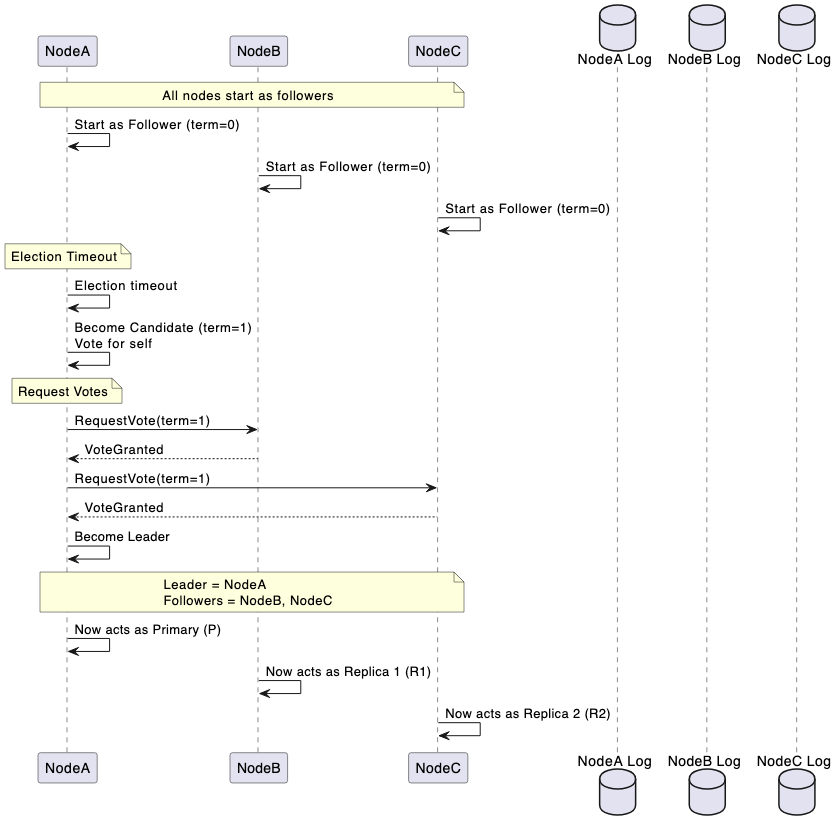
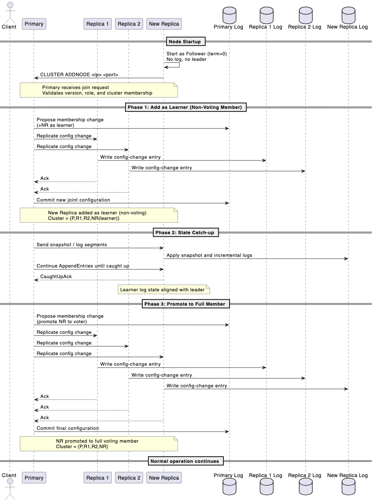
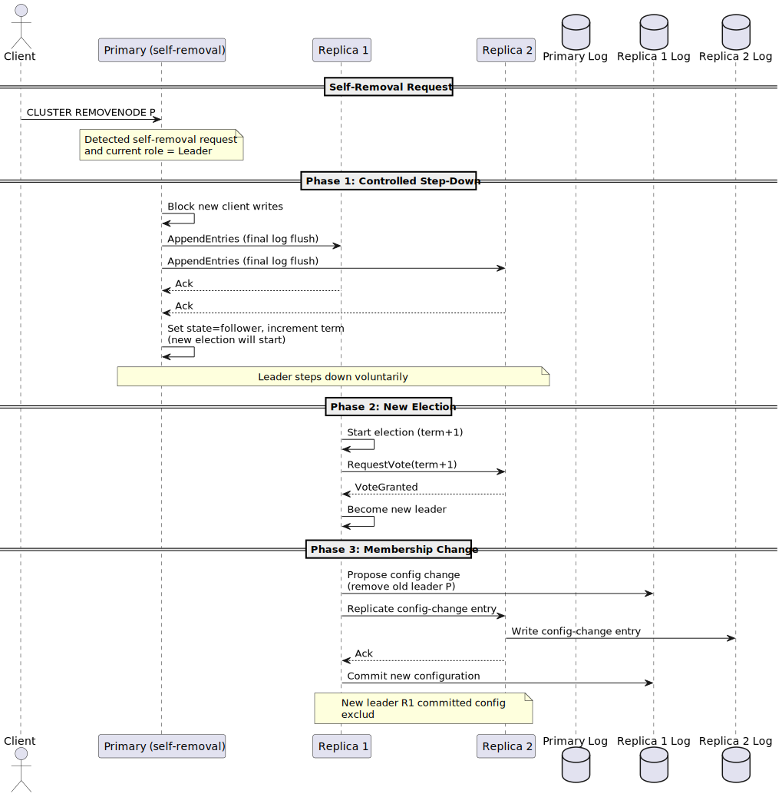
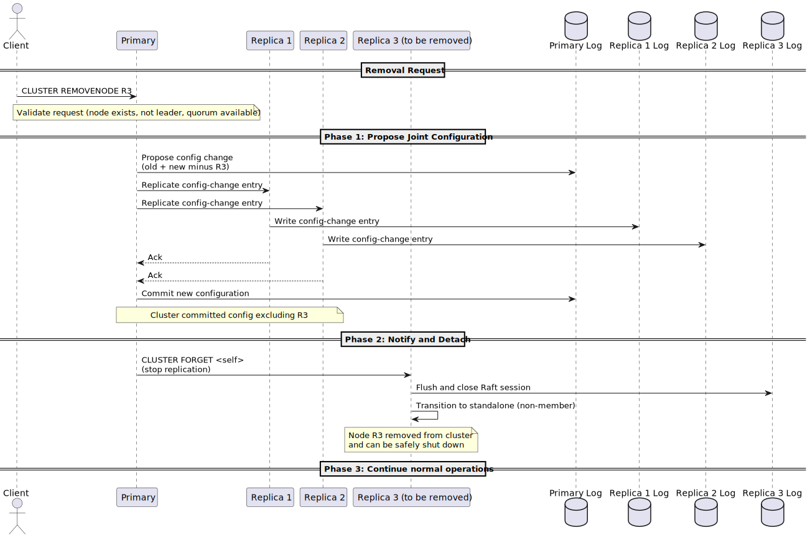
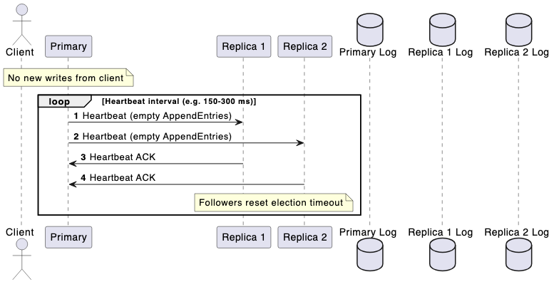
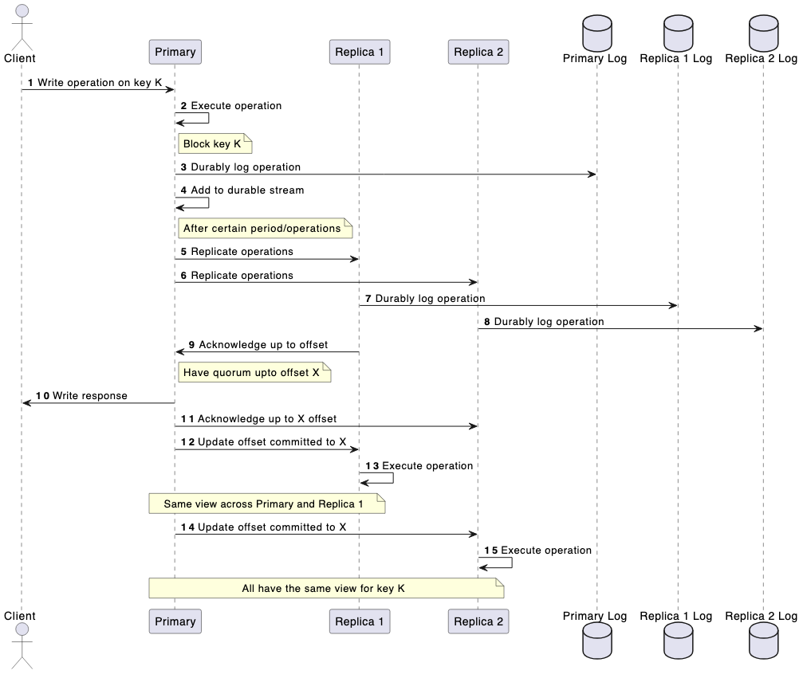
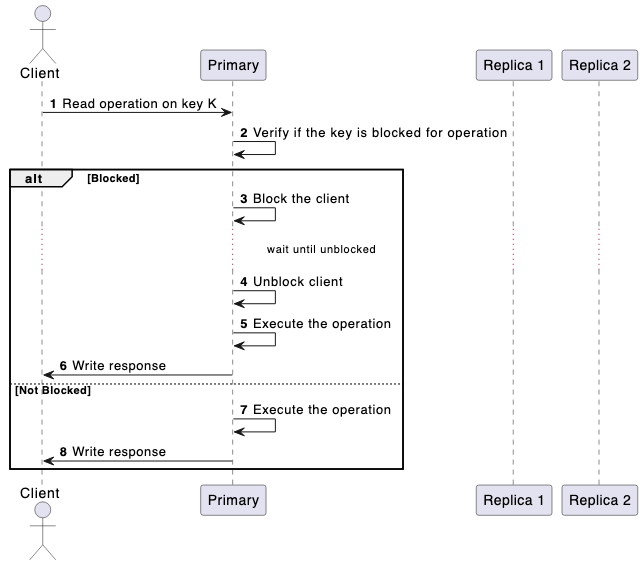
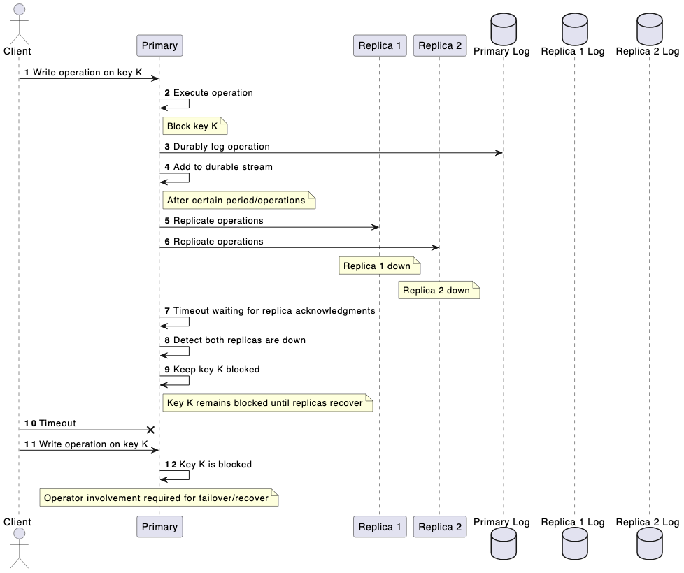

# Durability HLD

This document is a working draft of the high level architecture of durability and will transfer to RFC once all the co-authors are inline with the design.

## Problem Statement

Valkey is an in-memory data store designed for high performance. However, this creates challenges for durability. By default, all the data resides in memory which means it can be lost during crashes or process restarts. Although Valkey provides mechanisms such as periodic snapshots (RDB) and append-only logs (AOF) to persist data to disk, these approaches involve trade-offs between performance and reliability. Snapshots may lose recent writes and AOF is only applicable to node level durability with it’s own quirks. Also, with a failover operation in cluster mode, data can be lost by promoting a replica which might be out-of-sync which also leads to data loss. There is a client side mechanism of `WAIT` operation to block other operations until the data gets synced across replica(s) which requires client side orchestration and isn’t intuitive.

In order to tackle all these problem around durability, it needs to be thought from ground up and build the system to be tolerant against node failure, topology changes, etc and the durability guarantee to be completely managed by the engine.

## Requirements

Please refer [https://github.com/valkey-io/valkey-rfc/pull/29/](https://github.com/valkey-io/valkey-rfc/pull/29/files) for detailed requirements

* Server level durability configuration
* Configurable isolation level 
    * Read committed 
* Maintain same deployment architecture
* Support standalone/cluster(single shard) 
* Support 1 Primary and 2 Replica(s) 

Not targeting P0 but planned for future deliverable:

* Dirty reads
* Multi shard support for scalability
* Support 1 primary and 1 replica in a shard

## High Level Approach

There are a few major parts to Valkey in terms of adding durability support.

1. Durability logging
2. Command execution
3. Topology changes

### Write-ahead logging

Writes out the command to be executed durably across the system and then executes the operation on primary and further instructs the replica to execute the operation.

#### Pro(s)

1. Opt to blocking of read operation on modified key(s).
2. If the durable operation fails, there is no dirty data to cleanup on the primary and the operation can be retried.

Con(s)

1. Commands with random operation like `SPOP` and Lua scripts without predefined keys can’t be handled.
2. Commands with blocking operation needs special handling.

### Write-behind logging (Recommended)

Modifies the data on in-memory view of primary first and then does the durable operation across the system.

#### Pro(s)

1. Handles all operation (regular commands, random commands, blocking commands) in straight forward approach.
2. Piggyback on blocking code infrastructure to handle writes.

#### Con(s)

1. Blocks the key for both read/write operation until the operation has been durably stored across the shard.
2. Failover on failure write operation going through.

## How to structure the durably logging component in Valkey?

### Durable engine embedded within Valkey


#### Pro(s):

1. Repurpose existing pieces for snapshotting, durable log (AOF)
2. Single unified deployment 

#### Cons(s):

1. Requires building synchronous replication or quorum based replication system.
2. More overlap of asynchronous replication and synchronous replication system.

Open Questions:

1. Do we consider an approach of P0 allowing the logging component to be available as in-memory temporary log instead of maintaining it on disk? This mechanism would allow higher throughput.

## Workflows

### Lifecycle of membership changes

#### Bootstrap



##### Points to consider:

> How to discover peer nodes?

New nodes establish connection between each other via the `shard-nodes` config which is a list of ip:port address.

> When to start the initialization phase?

When the node is connected to majority of the nodes.


#### Node addition



####  Primary removal (Manual Failover)



#### Replica removal / failure



#### 

* * *

### Leader liveness


<details>

<summary>UML code for heartbeat</summary>

```
@startuml
actor Client
participant "Primary" as P
participant "Replica 1" as R1
participant "Replica 2" as R2
database "Primary Log" as PL
database "Replica 1 Log" as R1L
database "Replica 2 Log" as R2L

autonumber
note over P: No new writes from client

loop Heartbeat interval (e.g. 150–300 ms)
  P -> R1: Heartbeat (empty AppendEntries)
  P -> R2: Heartbeat (empty AppendEntries)
  R1 -> P: Heartbeat ACK
  R2 -> P: Heartbeat ACK
  note over R1, R2: Followers reset election timeout
end
@enduml
```

</details>

### Lifecycle of a write command 



<details>

<summary>UML code for lifecycle of a write command</summary>

```
@startuml
actor Client
participant "Primary" as P
participant "Replica 1" as R1
participant "Replica 2" as R2
database "Primary Log" as PL
database "Replica 1 Log" as R1L
database "Replica 2 Log" as R2L

autonumber
Client -> P: Write operation on key K
P -> P: Execute operation
note right of P: Block key K
P -> PL: Durably log operation
P -> P: Add to durable stream
note right of P: After certain period/operations
P -> R1: Replicate operations
P -> R2: Replicate operations
R1 -> R1L: Durably log operation
R2 -> R2L: Durably log operation
R1 -> P: Acknowledge up to offset
note right of P: Have quorum upto offset X
P -> Client: Write response
P -> R2 : Acknowledge up to X offset
P -> R1: Update offset committed to X
R1 -> R1: Execute operation
note over P, R1: Same view across Primary and Replica 1
P -> R2: Update offset committed to X
R2 -> R2: Execute operation
note over P, R2: All have the same view for key K
@enduml
```

</details>

### Lifecycle of a read command 



<details>

<summary>UML code for lifecycle of a read command</summary>

```
@startuml
actor Client
participant "Primary" as P
participant "Replica 1" as R1
participant "Replica 2" as R2

autonumber
Client -> P: Read operation on key K
P -> P: Verify if the key is blocked for operation
alt Blocked
  P -> P: Block the client
  ... wait until unblocked ...
  P -> P: Unblock client
  P -> P: Execute the operation
  P -> Client: Write response
else Not Blocked
  P -> P: Execute the operation
  P -> Client: Write response
end
@enduml
```
</details>

### Write outage

Write failure in a shard can be observed when quorum isn’t possible to reach for a write operation.



<details>

<summary>UML code for write outage scenario</summary>

```
@startuml
actor Client
participant "Primary" as P
participant "Replica 1" as R1
participant "Replica 2" as R2
database "Primary Log" as PL
database "Replica 1 Log" as R1L
database "Replica 2 Log" as R2L

autonumber
Client -> P: Write operation on key K
P -> P: Execute operation
note right of P: Block key K
P -> PL: Durably log operation
P -> P: Add to durable stream
note right of P: After certain period/operations
P -> R1: Replicate operations
P -> R2: Replicate operations
note over R1: Replica 1 down
note over R2: Replica 2 down
P -> P: Timeout waiting for replica acknowledgments
P -> P: Detect both replicas are down
P -> P: Keep key K blocked
note right of P: Key K remains blocked until replicas recover
Client-x P: Timeout
Client-> P: Write operation on key K
P -> P: Key K is blocked
note over P: Operator involvement required for failover/recover
@enduml
```

</details>

### Cluster

Clustering is composed of three intertwined mechanisms:

1. **Topology Gossip**
2. **Health/Failure Detection**
3. **Failover Operation**

With RAFT introduced at the shard level, consensus is built in for durable data transfer within each shard. RAFT also manages leader election through regular heartbeats: when a leader fails, a new candidate from within the shard is promoted.
This RAFT-based leader failure detection overlaps heavily with the existing clusterbus health detection and best-effort failover systems. To avoid duplication, both of those must be disabled.
The **clusterbus** can still be repurposed for topology gossip across shards. This introduces only minimal overhead and does not affect shard ownership. It remains useful for client redirection of datapath commands (read/write operations).

### Asychronous Replication

Asynchronous replication system will co-exist with the synchronous replication system to allow users to use Valkey with high availability but not high durable system. 

### LUA Scripts

To be filled

### ACL

No impact on ACL

### Additional Configs

* Name: `shard-nodes` Value: Multiple ip address and port (comma separated)

## Appendix

<details>

<summary>UML code for bootstrap</summary>

```uml
@startuml
participant "NodeA" as A
participant "NodeB" as B
participant "NodeC" as C
database "NodeA Log" as AL
database "NodeB Log" as BL
database "NodeC Log" as CL

note over A,C: All nodes load shard-nodes from config
A -> A: shard-nodes = {A,B,C}
B -> B: shard-nodes = {A,B,C}
C -> C: shard-nodes = {A,B,C}

A -> B: Connect
B --> A: ACK
A -> C: Connect
C --> A: ACK
B -> C: Connect
C --> B: ACK

note over A,C: All nodes know each other

note over A,C: All nodes start as followers
A -> A: Start as Follower (term=0)
B -> B: Start as Follower (term=0)
C -> C: Start as Follower (term=0)

note over A: Election Timeout
A -> A: Election timeout
A -> A: Become Candidate (term=1)\nVote for self

note over A: Request Votes
A -> B: RequestVote(term=1)
B --> A: VoteGranted
A -> C: RequestVote(term=1)
C --> A: VoteGranted


A -> A: Become Leader

note over A,C
Leader = NodeA
Followers = NodeB, NodeC
end note

A -> A: Now acts as Primary (P)
B -> B: Now acts as Replica 1 (R1)
C -> C: Now acts as Replica 2 (R2)

@enduml
```

</details>

<details>

<summary>UML code for Node Addition</summary>

```
@startuml
actor Client
participant "Primary" as P
participant "Replica 1" as R1
participant "Replica 2" as R2
participant "New Replica" as NR
database "Primary Log" as PL
database "Replica 1 Log" as R1L
database "Replica 2 Log" as R2L
database "New Replica Log" as NRL

== Node Startup ==
NR -> NR: Start as Follower (term=0)\nNo log, no leader
NR -> P: CLUSTER ADDNODE <ip> <port>

note over P,NR
Primary receives join request
Validates version, role, and cluster membership
end note

== Phase 1: Add as Learner (Non-Voting Member) ==
P -> PL: Propose membership change\n(+NR as learner)
P -> R1: Replicate config change
P -> R2: Replicate config change
R1L <- R1: Write config-change entry
R2L <- R2: Write config-change entry
R1 --> P: Ack
R2 --> P: Ack
P -> PL: Commit new joint configuration
note over P,NR
New Replica added as learner (non-voting)
Cluster = {P,R1,R2,NR(learner)}
end note

== Phase 2: State Catch-up ==
P -> NR: Send snapshot / log segments
NRL <- NR: Apply snapshot and incremental logs
P -> NR: Continue AppendEntries until caught up
NR --> P: CaughtUpAck
note over NR: Learner log state aligned with leader

== Phase 3: Promote to Full Member ==
P -> PL: Propose membership change\n(promote NR to voter)
P -> R1: Replicate config change
P -> R2: Replicate config change
P -> NR: Replicate config change
R1L <- R1: Write config-change entry
R2L <- R2: Write config-change entry
NRL <- NR: Write config-change entry
R1 --> P: Ack
R2 --> P: Ack
NR --> P: Ack
P -> PL: Commit final configuration
note over P,NR
NR promoted to full voting member
Cluster = {P,R1,R2,NR}
end note

== Normal operation continues ==

@enduml
```

</details>

<details>

<summary>UML code for Replica removal</summary>

```
@startuml
actor Client
participant "Primary" as P
participant "Replica 1" as R1
participant "Replica 2" as R2
participant "Replica 3 (to be removed)" as R3
database "Primary Log" as PL
database "Replica 1 Log" as R1L
database "Replica 2 Log" as R2L
database "Replica 3 Log" as R3L

== Removal Request ==
Client -> P: CLUSTER REMOVENODE R3
note over P: Validate request (node exists, not leader, quorum available)

== Phase 1: Propose Joint Configuration ==
P -> PL: Propose config change\n(old + new minus R3)
P -> R1: Replicate config-change entry
P -> R2: Replicate config-change entry
R1L <- R1: Write config-change entry
R2L <- R2: Write config-change entry
R1 --> P: Ack
R2 --> P: Ack
P -> PL: Commit new configuration
note over P,R2: Cluster committed config excluding R3

== Phase 2: Notify and Detach ==
P -> R3: CLUSTER FORGET <self>\n(stop replication)
R3 -> R3L: Flush and close Raft session
R3 -> R3: Transition to standalone (non-member)
note over R3: Node R3 removed from cluster\nand can be safely shut down

== Phase 3: Continue normal operations ==
@enduml
```
</details>

<details>

<summary>UML code for Primary Removal</summary>

```
@startuml
actor Client
participant "Primary (self-removal)" as P
participant "Replica 1" as R1
participant "Replica 2" as R2
database "Primary Log" as PL
database "Replica 1 Log" as R1L
database "Replica 2 Log" as R2L

== Self-Removal Request ==
Client -> P: CLUSTER REMOVENODE P
note over P: Detected self-removal request\nand current role = Leader

== Phase 1: Controlled Step-Down ==
P -> P: Block new client writes
P -> R1: AppendEntries (final log flush)
P -> R2: AppendEntries (final log flush)
R1 --> P: Ack
R2 --> P: Ack
P -> P: Set state=follower, increment term\n(new election will start)
note over P,R2: Leader steps down voluntarily

== Phase 2: New Election ==
R1 -> R1: Start election (term+1)
R1 -> R2: RequestVote(term+1)
R2 --> R1: VoteGranted
R1 -> R1: Become new leader

== Phase 3: Membership Change ==
R1 -> R1L: Propose config change\n(remove old leader P)
R1 -> R2: Replicate config-change entry
R2L <- R2: Write config-change entry
R2 --> R1: Ack
R1 -> R1L: Commit new configuration
note over R1,R2: New leader R1 committed config\nexclud
```

</details>

