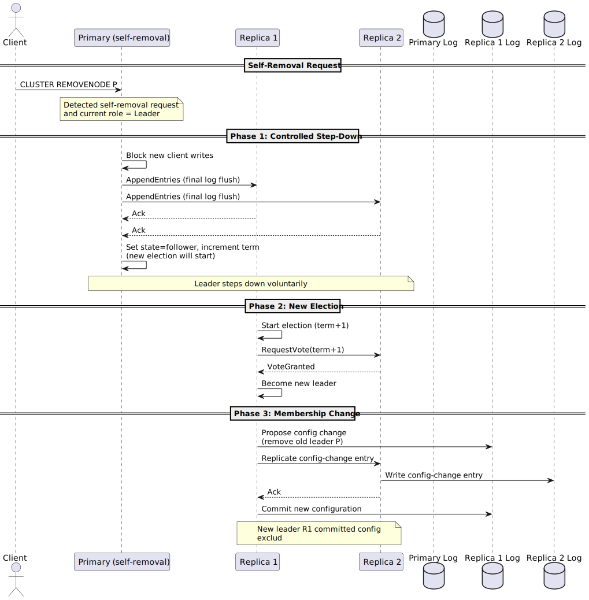
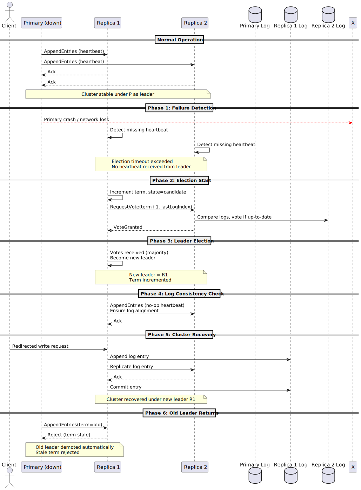

# Durability HLD

This document is a working draft of the high level architecture of durability and will transfer to RFC once all the co-authors are inline with the design.

## Problem Statement

Valkey is an in-memory data store designed for high performance. Valkey currently uses an asynchronous replication model for high throughput and low latency, which means writes acknowledged to clients may be lost if replicas lag, crash, or are promoted while out-of-sync. Because all data resides in memory by default, process restarts or crashes risk losing recent writes. Although periodic snapshots (RDB) and append-only logs (AOF) provide persistence, they entail trade-offs: snapshots may omit recent writes and AOF only supports single-node durability. In cluster mode, data loss remains possible when a replica is promoted prematurely. Shifting durability responsibility to clients (via WAIT) is not intuitive and places burden on the application layer.

## Motivation

While Valkey’s asynchronous model prioritizes performance, many production workloads demand stronger guarantees where acknowledged writes will never be lost, even under failures. This specification introduces a unified durability layer that defines when a write is truly “safe” ensures deterministic behavior during failover, and simplifies client integration by removing the need for ad-hoc mechanisms like `WAIT`.

To achieve this, the specification adopts a formally defined state machine replication model, namely [RAFT](https://en.wikipedia.org/wiki/Raft_(algorithm)), making the guarantees explicit and verifiable acting as a precise contract between the system and its users.

## Requirements

Please refer [https://github.com/valkey-io/valkey-rfc/pull/29/](https://github.com/valkey-io/valkey-rfc/pull/29/files) for detailed requirements

* Server level durability configuration - Valkey must allow enabling/disabling durability mode at startup.
* Read Committed isolation level - Every write operation is serialized on primary and client won't see a volatile key.
* Maintain current deployment architecture - No additional dependencies.
* Support standalone/cluster(single shard) modes.  
* Support a minimum 3 node configuration - one primary and two (or more) replicas.

Planned for future:

* Dirty reads and configurable isolation level
* Multi shard durability - Allow scaling of writes.
* Two node durability configuration (one primary and one replica)

## Design Overview

The durability specification introduces a **RAFT-based state machine replication** model at the shard level, ensuring deterministic leadership, consistent log replication, and predictable recovery across Valkey cluster. Each shard operates as an independent group consisting of one leader (primary) and multiple followers (replicas).
All write operations flow through the primary and are durably replicated before being acknowledged.
Replication and election are handled at shard granularity, ensuring fault isolation and predictable recovery. A write is considered durable once it has been replicated to a quorum of nodes and safely committed in the leader’s log. Acknowledged writes are guaranteed to survive any single-node or minority failure.


Elections are managed using RAFT’s randomized timeout and term-based voting mechanism, ensuring that at any point, only one valid leader can exist per shard. Followers that fall behind automatically catch up through incremental log replication. 

### Key Components

There are a few major parts to Valkey to be modified to add durability support.

1. Command execution
2. Blocking
3. Logging
4. Topology changes

### Command Execution

All write commands are routed to the shard leader (primary), which serves as the serialization point for that shard.
 The leader ensures serializable execution by processing commands in the exact order they are received, establishing a single total sequence for all writes.

Upon receiving a write:

1. The leader applies the command to its local in-memory state immediately, ensuring fast execution.
2. The corresponding log entry is appended to the RAFT log and replicated asynchronously to follower nodes.
3. The client response is blocked until quorum acknowledgment confirms that the entry is durably replicated and committed.

This design allows the system to continue command execution and replication in parallel, while ensuring that clients only receive success once durability is guaranteed.
If the leader fails before quorum commit, uncommitted entries are rolled back or overwritten during recovery.
Followers apply committed entries strictly in log index order, ensuring deterministic state across replicas.

### Blocking

Blocking determines when a client receives acknowledgment for an operation relative to its durability state.
While the leader applies a command immediately to its in-memory state, the client response is held until the entry is confirmed by the configured durability mode. This ensures that acknowledgment semantics always reflect the intended durability guarantees. The client remains blocked until a quorum of replicas (**synchronous mode**) acknowledges the log entry, guaranteeing durability against minority or single-node failures.

Blocking occurs only at the primary. Replica nodes apply entries passively as they are received and do not block client operations directly.
Read operations and other non-durable commands are not affected by blocking behavior.

Notes:

We could make the blocking mode configurable in the future and introduce two additional modes:

- **Asynchronous mode:** The client receives acknowledgment immediately after the leader applies the command locally. This mode prioritizes latency over durability.
- **Semi-synchronous mode:** The client is unblocked once at least one replica acknowledges the log entry, providing a balance between durability and performance.

#### Memory Pressure from client output buffers

Under high pressure of write load or when replicas fall behind, the number of blocked clients can grow significantly, leading to increased memory pressure on the primary. Each blocked client consumes memory for pending responses on the output buffers. This will capped by the existing configuration of client-output-buffer-limit for replica (replication buffer limit). 

Open Questions:

* Should a mechanism be introduced to temporarily block all new write traffic once the replication buffer limit is reached, effectively stalling writes until the backlog is cleared? This could prevent unbounded memory growth and avoid triggering failover operations caused by memory exhaustion. 
* Should we perform a side channel heartbeat (AppendEntries with no content) to keep the primary healthy?

### Logging

The logging subsystem forms the backbone of durability in this specification. Every write operation is recorded in a replicated, append-only log that defines a total, ordered sequence of commands within each shard. This log is responsible for guaranteeing that once an entry is committed, it can be recovered, replayed, and applied consistently across all replicas. It also serves as the basis for replication (through RAFT’s AppendEntries), leader election safety, and fault recovery.

The integration between the log and Valkey’s in-memory execution model can follow two distinct approaches

#### Write-Ahead Logging

In the write-ahead logging approach, every command is first recorded in the replicated RAFT log before any modification is made to the in-memory state. This ensures that the log always represents the authoritative record of intended changes, allowing recovery to replay committed entries deterministically after failure.

#### Pro(s)

1. Opt to blocking of read operation on modified key(s).
2. If the durable operation fails, there is no dirty data to cleanup on the primary and the operation can be retried.

#### Con(s)

1. Commands with random operation like `SPOP` needs to be made deterministic across all the nodes in a shard.
2. Lua scripts cannot be safely supported under write-ahead logging because their read and write sets are only known during execution. Since WAL requires the command to be logged before execution, it cannot capture the dynamic side effects or conditional logic inside a script.
3. Commands with blocking operation needs special handling 

#### Write-Behind logging (Recommended)

In the write-behind logging approach, a command is first applied to the primary’s in-memory state before being appended to the replicated RAFT log. This is inline with the current asynchronous replication model. This allows command execution and replication to proceed in parallel, maintaining Valkey’s low-latency characteristics while still ensuring durability through delayed acknowledgment.

#### Pro(s)

1. Handles all operation (regular commands, random commands, blocking commands) in straight forward approach. `SPOP` gets translated to `SREM` making it a deterministic command.
2. Lua scripts fit well with Write-behind logging since the script executes atomically on the primary before replication.
   The primary runs the entire script, producing a deterministic sequence of writes that can then be logged and replicated to followers.

#### Con(s)

1. Blocks the key for both read/write operation until the operation has been durably stored across the shard.
2. Introduces challenges to handle uncommitted entries due to node failures leading to potential failover operation and replaying the data to sync.

##### Side-by-Side Comparison 

| Stage                | Write-Ahead Logging      | Write-Behind Logging       |
| -------------------- | ------------------------ | -------------------------- |
| 1. Receive command   | Append to log, replicate | Apply to memory, replicate |
| 2. Wait for quorum   | Before execution         | Before acknowledgment      |
| 3. Apply to memory   | After quorum             | Already done               |
| 4. Respond to client | After apply              | After quorum               |

| Aspect                                                       | Write-Ahead Logging (WAL)                                    | Write-Behind Logging (WBL)                                   |
| ------------------------------------------------------------ | ------------------------------------------------------------ | ------------------------------------------------------------ |
| Latency                                                      | Similar client-visible latency                               | Similar client-visible latency                               |
| Lua Scripts                                                  | Not supported. The write set is unknown before execution, making it impossible to log deterministically in advance. | Fully supported. Scripts execute atomically on the leader, and resulting writes are logged and replicated deterministically. |
| Random / Non-Deterministic Commands (e.g., `SPOP`, time-dependent logic) | Difficult to reproduce deterministically across replicas; unsafe under WAL. | Safe, since the command executes once on the leader and replicas only replay the deterministic result. |
| Expiration / TTL Handling                                    | Must log expiration events before applying them; can cause drift if clocks differ. | Similar to current Valkey behavior. Expirations are handled locally after commit and replicated as deterministic deletion. |
| Eviction (LRU/LFU)                                           | Harder to synchronize across replicas since memory changes occur only post-commit, eviction triggers may diverge. | Similar to current Valkey behavior. replicas eventually converge through state updates from primary. |
| Memory Pressure                                              | Lower runtime memory pressure because commands are not applied until committed; smaller transient state. | Higher memory pressure under replication lag, as unacknowledged writes and blocked client buffers accumulate. |

#### How to structure the durably logging component in Valkey?

### Durable engine embedded within Valkey


#### Pro(s):

1. Repurpose existing pieces for snapshotting, durable log (AOF)
2. Single unified deployment 

#### Cons(s):

1. Requires building synchronous replication or quorum based replication system.
2. More overlap of asynchronous replication and synchronous replication system.

#### Main thread vs Background thread

### Main Thread

- Logging and replication are handled directly within Valkey’s primary event loop.
- Commands, log appends, and replication I/O share the same execution path and scheduling.
- Log ordering is inherently aligned with command execution order.
- Simplifies correctness and state management since all actions occur on a single thread.
- Replication acknowledgment and client blocking are managed within the same loop cycle.
- Suitable for environments where predictability and deterministic command sequencing are more important than full CPU utilization.

### Dedicated Logging Thread

- The main thread executes commands and enqueues log entries for a background replication/logging thread.
- The logging thread manages replication, quorum acknowledgment, and commit advancement asynchronously.
- Communication between the main thread and logging thread occurs via a bounded, ordered queue.
- Avoids stalling issues with long running command execution/LUA script execution 
- Requires coordination between main thread and logging thread about offset progress.
- Could extend the io threads framework used primarily for networking.

Open Questions:

1. Should we start with same thread for end-to-end operation for P0 and then move to further improvements?
1. Should we consider an approach for initial release to allow the logging component to be available as in-memory instead of fsync it on disk? This mechanism would allow higher throughput and lower latency. Need to ponder about the risks/recovery time on node failure to perform a full synchronization.

### Log File Format


## Workflows

### Cluster Bootstrap ([UML code](#uml-code-for-bootstrap))


##### Points to consider:

* How to discover peer nodes?
  * New nodes establish connection between each other via the `shard-nodes` config which is a list of ip:port address.
* When to start the initialization phase?
  * When the node is connected to majority of the nodes.

### Node addition([UML Code](#uml-code-for-node-addition))


### Primary removal ([UML Code](#uml-code-for-primary-removal))



### Replica removal ([UML Code](#uml-code-for-replica-removal))


### Lifecycle of a write command ([UML Code](#uml-code-for-lifecycle-of-a-write-command))


### Lifecycle of a read command ([UML Code](#UML-code-for-lifecycle-of-a-read-command))


## Failure Modes

### Primary liveness ([UML Code](#uml-code-for-leader-liveness))


### Primary Failure (Automatic Failover) ([UML Code](#uml-code-for-primary-failure))



### Replica Failure

Has the same behavior as replica removal outlined earlier in the topology change section.

### Complete Write Outage ([UML Code](#uml-code-for-write-outage))

Complete write outage in a shard can be observed when quorum isn’t possible to reach for a write operation. This could be due to network partition for a period exceeding the timeout period of a client and the operation result couldn't be acknowledged back to the client. This would leave the primary dirty and in an inconsistent state. Hence, it's require


### Expiration

### Eviction

### Cluster

Clustering is composed of three intertwined mechanisms:

1. **Topology Gossip**
2. **Health/Failure Detection**
3. **Failover Operation**

With RAFT introduced at the shard level, consensus is built in for durable data transfer within each shard. RAFT also manages leader election through regular heartbeats: when a leader fails, a new candidate from within the shard is promoted.
This RAFT-based leader failure detection overlaps heavily with the existing clusterbus health detection and best-effort failover systems. To avoid duplication, both of those must be disabled.
The **clusterbus** can still be repurposed for topology gossip across shards. This introduces only minimal overhead and does not affect shard ownership. It remains useful for client redirection of datapath commands (read/write operations).

### Asychronous Replication

Asynchronous replication system will co-exist with the synchronous replication system to allow users to use Valkey with high availability but not high durable system i.e. backward compatible in terms of performance/behavior.

### LUA Scripts

To be filled

### ACL

No impact on ACL

## Appendix

### Alternative Design with centralized log storage

This approach is different from the recommendation above with decoupling the durable storage component from the Valkey in-memory store engine.


### UML code for bootstrap

```uml
@startuml
participant "NodeA" as A
participant "NodeB" as B
participant "NodeC" as C
database "NodeA Log" as AL
database "NodeB Log" as BL
database "NodeC Log" as CL

note over A,C: All nodes load shard-nodes from config
A -> A: shard-nodes = {A,B,C}
B -> B: shard-nodes = {A,B,C}
C -> C: shard-nodes = {A,B,C}

A -> B: Connect
B --> A: ACK
A -> C: Connect
C --> A: ACK
B -> C: Connect
C --> B: ACK

note over A,C: All nodes know each other

note over A,C: All nodes start as followers
A -> A: Start as Follower (term=0)
B -> B: Start as Follower (term=0)
C -> C: Start as Follower (term=0)

note over A: Election Timeout
A -> A: Election timeout
A -> A: Become Candidate (term=1)\nVote for self

note over A: Request Votes
A -> B: RequestVote(term=1)
B --> A: VoteGranted
A -> C: RequestVote(term=1)
C --> A: VoteGranted


A -> A: Become Leader

note over A,C
Leader = NodeA
Followers = NodeB, NodeC
end note

A -> A: Now acts as Primary (P)
B -> B: Now acts as Replica 1 (R1)
C -> C: Now acts as Replica 2 (R2)

@enduml
```

### UML code for Node Addition

```
@startuml
actor Client
participant "Primary" as P
participant "Replica 1" as R1
participant "Replica 2" as R2
participant "New Replica" as NR
database "Primary Log" as PL
database "Replica 1 Log" as R1L
database "Replica 2 Log" as R2L
database "New Replica Log" as NRL

== Node Startup ==
NR -> NR: Start as Follower (term=0)\nNo log, no leader
NR -> P: CLUSTER ADDNODE <ip> <port>

note over P,NR
Primary receives join request
Validates version, role, and cluster membership
end note

== Phase 1: Add as Learner (Non-Voting Member) ==
P -> PL: Propose membership change\n(+NR as learner)
P -> R1: Replicate config change
P -> R2: Replicate config change
R1L <- R1: Write config-change entry
R2L <- R2: Write config-change entry
R1 --> P: Ack
R2 --> P: Ack
P -> PL: Commit new joint configuration
note over P,NR
New Replica added as learner (non-voting)
Cluster = {P,R1,R2,NR(learner)}
end note

== Phase 2: State Catch-up ==
P -> NR: Send snapshot / log segments
NRL <- NR: Apply snapshot and incremental logs
P -> NR: Continue AppendEntries until caught up
NR --> P: CaughtUpAck
note over NR: Learner log state aligned with leader

== Phase 3: Promote to Full Member ==
P -> PL: Propose membership change\n(promote NR to voter)
P -> R1: Replicate config change
P -> R2: Replicate config change
P -> NR: Replicate config change
R1L <- R1: Write config-change entry
R2L <- R2: Write config-change entry
NRL <- NR: Write config-change entry
R1 --> P: Ack
R2 --> P: Ack
NR --> P: Ack
P -> PL: Commit final configuration
note over P,NR
NR promoted to full voting member
Cluster = {P,R1,R2,NR}
end note

== Normal operation continues ==

@enduml
```

### UML code for Replica Removal

```
@startuml
actor Client
participant "Primary" as P
participant "Replica 1" as R1
participant "Replica 2" as R2
participant "Replica 3 (to be removed)" as R3
database "Primary Log" as PL
database "Replica 1 Log" as R1L
database "Replica 2 Log" as R2L
database "Replica 3 Log" as R3L

== Removal Request ==
Client -> P: CLUSTER REMOVENODE R3
note over P: Validate request (node exists, not leader, quorum available)

== Phase 1: Propose Joint Configuration ==
P -> PL: Propose config change\n(old + new minus R3)
P -> R1: Replicate config-change entry
P -> R2: Replicate config-change entry
R1L <- R1: Write config-change entry
R2L <- R2: Write config-change entry
R1 --> P: Ack
R2 --> P: Ack
P -> PL: Commit new configuration
note over P,R2: Cluster committed config excluding R3

== Phase 2: Notify and Detach ==
P -> R3: CLUSTER FORGET <self>\n(stop replication)
R3 -> R3L: Flush and close Raft session
R3 -> R3: Transition to standalone (non-member)
note over R3: Node R3 removed from cluster\nand can be safely shut down

== Phase 3: Continue normal operations ==
@enduml
```
### UML code for Primary Removal

```
@startuml
actor Client
participant "Primary (self-removal)" as P
participant "Replica 1" as R1
participant "Replica 2" as R2
database "Primary Log" as PL
database "Replica 1 Log" as R1L
database "Replica 2 Log" as R2L

== Self-Removal Request ==
Client -> P: CLUSTER REMOVENODE P
note over P: Detected self-removal request\nand current role = Leader

== Phase 1: Controlled Step-Down ==
P -> P: Block new client writes
P -> R1: AppendEntries (final log flush)
P -> R2: AppendEntries (final log flush)
R1 --> P: Ack
R2 --> P: Ack
P -> P: Set state=follower, increment term\n(new election will start)
note over P,R2: Leader steps down voluntarily

== Phase 2: New Election ==
R1 -> R1: Start election (term+1)
R1 -> R2: RequestVote(term+1)
R2 --> R1: VoteGranted
R1 -> R1: Become new leader

== Phase 3: Membership Change ==
R1 -> R1L: Propose config change\n(remove old leader P)
R1 -> R2: Replicate config-change entry
R2L <- R2: Write config-change entry
R2 --> R1: Ack
R1 -> R1L: Commit new configuration
note over R1,R2: New leader R1 committed config\nexclud
```

### UML code for Primary Failure

```
@startuml
actor Client
participant "Primary (down)" as P
participant "Replica 1" as R1
participant "Replica 2" as R2
database "Primary Log" as PL
database "Replica 1 Log" as R1L
database "Replica 2 Log" as R2L

== Normal Operation ==
P -> R1: AppendEntries (heartbeat)
P -> R2: AppendEntries (heartbeat)
R1 --> P: Ack
R2 --> P: Ack
note over P,R2: Cluster stable under P as leader

== Phase 1: Failure Detection ==
P -[#red]-> X: Primary crash / network loss
R1 -> R1: Detect missing heartbeat
R2 -> R2: Detect missing heartbeat
note over R1,R2: Election timeout exceeded\nNo heartbeat received from leader

== Phase 2: Election Start ==
R1 -> R1: Increment term, state=candidate
R1 -> R2: RequestVote(term+1, lastLogIndex)
R2 -> R2L: Compare logs, vote if up-to-date
R2 --> R1: VoteGranted

== Phase 3: Leader Election ==
R1 -> R1: Votes received (majority)\nBecome new leader
note over R1,R2: New leader = R1\nTerm incremented

== Phase 4: Log Consistency Check ==
R1 -> R2: AppendEntries (no-op heartbeat)\nEnsure log alignment
R2 --> R1: Ack

== Phase 5: Cluster Recovery ==
Client -> R1: Redirected write request
R1 -> R1L: Append log entry
R1 -> R2: Replicate log entry
R2 --> R1: Ack
R1 -> R1L: Commit entry
note over R1,R2: Cluster recovered under new leader R1

== Phase 6: Old Leader Returns ==
P -> R1: AppendEntries(term=old)
R1 --> P: Reject (term stale)
note over R1,P: Old leader demoted automatically\nStale term rejected
@enduml
```

### UML code for Leader Liveness

```
@startuml
actor Client
participant "Primary" as P
participant "Replica 1" as R1
participant "Replica 2" as R2
database "Primary Log" as PL
database "Replica 1 Log" as R1L
database "Replica 2 Log" as R2L

autonumber
note over P: No new writes from client

loop Heartbeat interval (e.g. 150–300 ms)
  P -> R1: Heartbeat (empty AppendEntries)
  P -> R2: Heartbeat (empty AppendEntries)
  R1 -> P: Heartbeat ACK
  R2 -> P: Heartbeat ACK
  note over R1, R2: Followers reset election timeout
end
@enduml
```

### UML code for lifecycle of a write command

```
@startuml
actor Client
participant "Primary" as P
participant "Replica 1" as R1
participant "Replica 2" as R2
database "Primary Log" as PL
database "Replica 1 Log" as R1L
database "Replica 2 Log" as R2L

autonumber
Client -> P: Write operation on key K
P -> P: Execute operation
note right of P: Block key K
P -> PL: Durably log operation
P -> P: Add to durable stream
note right of P: After certain period/operations
P -> R1: Replicate operations
P -> R2: Replicate operations
R1 -> R1L: Durably log operation
R2 -> R2L: Durably log operation
R1 -> P: Acknowledge up to offset
note right of P: Have quorum upto offset X
P -> Client: Write response
P -> R2 : Acknowledge up to X offset
P -> R1: Update offset committed to X
R1 -> R1: Execute operation
note over P, R1: Same view across Primary and Replica 1
P -> R2: Update offset committed to X
R2 -> R2: Execute operation
note over P, R2: All have the same view for key K
@enduml
```

### UML code for lifecycle of a read command

```
@startuml
actor Client
participant "Primary" as P
participant "Replica 1" as R1
participant "Replica 2" as R2

autonumber
Client -> P: Read operation on key K
P -> P: Verify if the key is blocked for operation
alt Blocked
  P -> P: Block the client
  ... wait until unblocked ...
  P -> P: Unblock client
  P -> P: Execute the operation
  P -> Client: Write response
else Not Blocked
  P -> P: Execute the operation
  P -> Client: Write response
end
@enduml
```

### UML code for write outage

```
@startuml
actor Client
participant "Primary" as P
participant "Replica 1" as R1
participant "Replica 2" as R2
database "Primary Log" as PL
database "Replica 1 Log" as R1L
database "Replica 2 Log" as R2L

autonumber
Client -> P: Write operation on key K
P -> P: Execute operation
note right of P: Block key K
P -> PL: Durably log operation
P -> P: Add to durable stream
note right of P: After certain period/operations
P -> R1: Replicate operations
P -> R2: Replicate operations
note over R1: Replica 1 down
note over R2: Replica 2 down
P -> P: Timeout waiting for replica acknowledgments
P -> P: Detect both replicas are down
P -> P: Keep key K blocked
note right of P: Key K remains blocked until replicas recover
Client-x P: Timeout
Client-> P: Write operation on key K
P -> P: Key K is blocked
note over P: Operator involvement required for failover/recover
@enduml
```
